# NSE OptionChain

An Android app for NSE index options traders. It does two things really well. It shows you the live option chain for the big index options while the market is open, and after the close it quietly builds a clean daily history of every core end of day dataset so you have real numbers to research and backtest against.

Everything saves as plain CSV files on your phone, so your data is yours and you can open it anywhere.

<p align="center">
  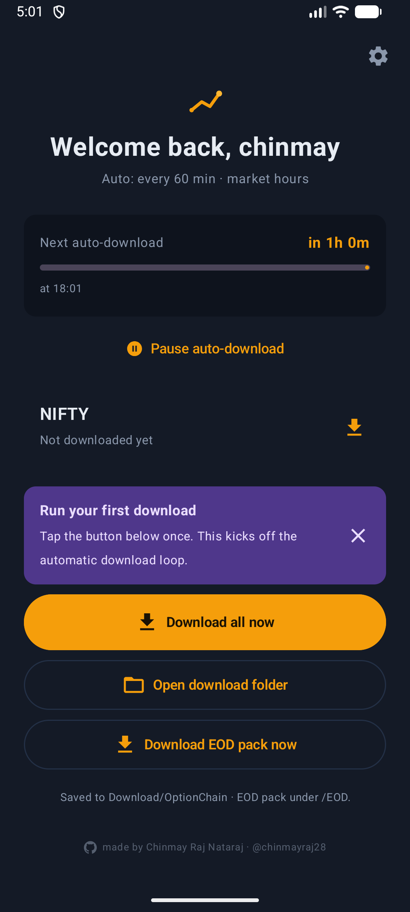
</p>

**Latest version: 2.0** — [download the APK](../../releases/latest)

## What it does

**Live option chains.** Watch NIFTY, BANKNIFTY, FINNIFTY, MIDCPNIFTY and NIFTYNXT50 straight from your phone. You choose the strikes, the expiries and the columns you care about, and the app can refresh on its own during market hours.

**Daily history pack.** Once a day after the market closes, around 6:30pm IST, the app downloads the official end of day files and stores them as CSVs. This is the part that turns a live viewer into a research tool. Only the final settled numbers go into history. Live intraday snapshots stay live and never mix into the sample.

## Setup, once

The app walks you through six short steps the first time you open it. Nothing here is permanent, all of it is changeable later in Settings.

| Your name | Pick your indices | Refresh schedule |
| :---: | :---: | :---: |
| 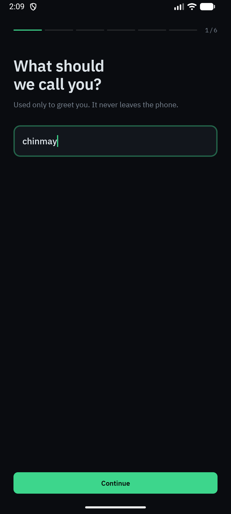 | 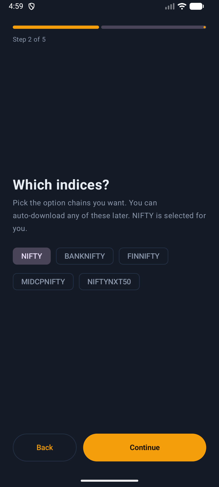 | 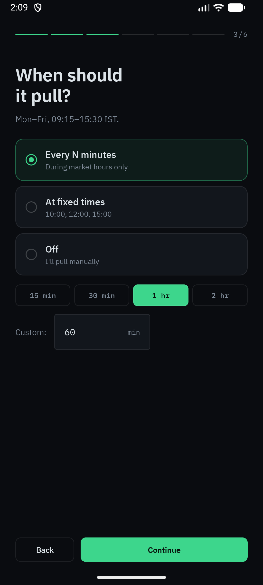 |

| Daily history | Copy to Drive | All set |
| :---: | :---: | :---: |
| 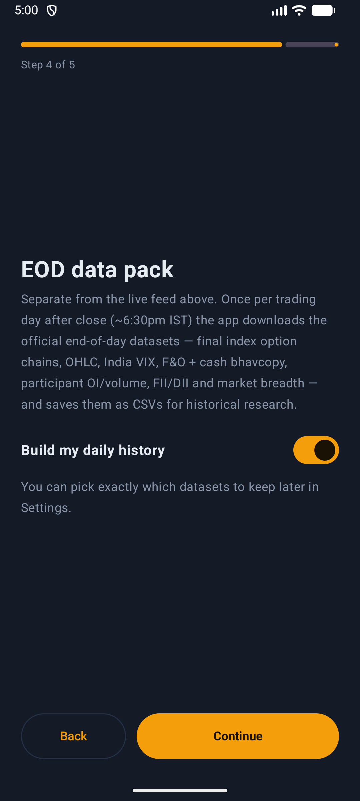 | 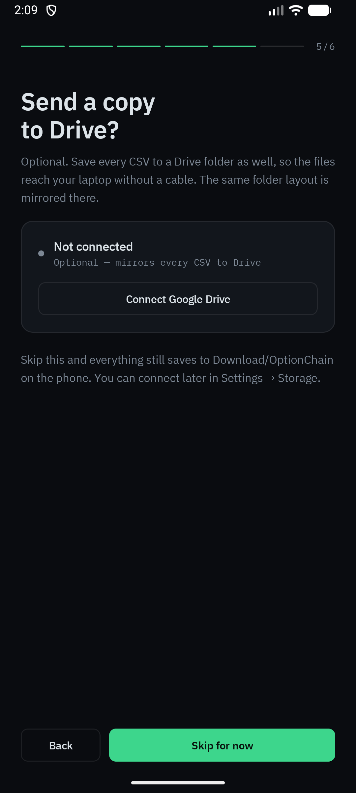 | 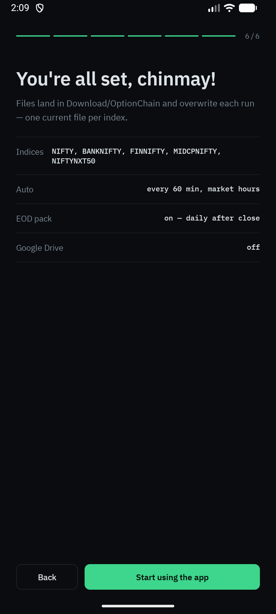 |

## Using it day to day

Four tabs. **Today** is the home screen with your countdown and watchlist, **Runs** is the history of everything the app has fetched, **Files** shows what is on disk, and **Settings** is where you change how it all behaves.

| Today | Files | Settings |
| :---: | :---: | :---: |
|  | 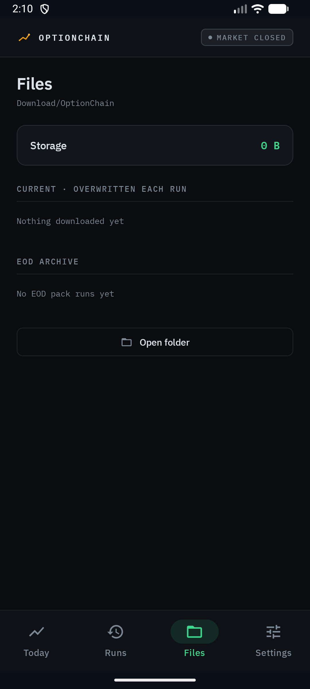 | 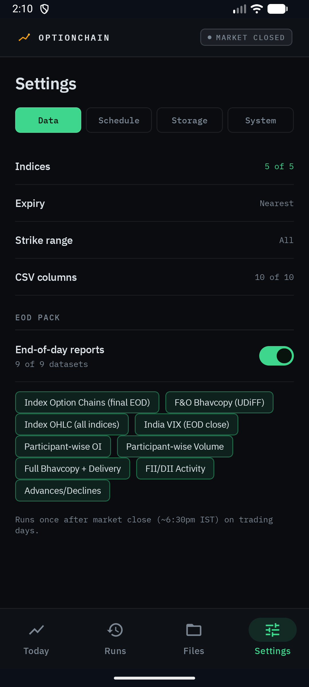 |

| Schedule | System |
| :---: | :---: |
| 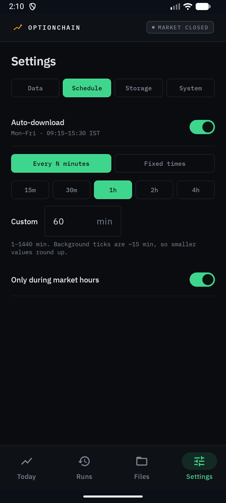 | 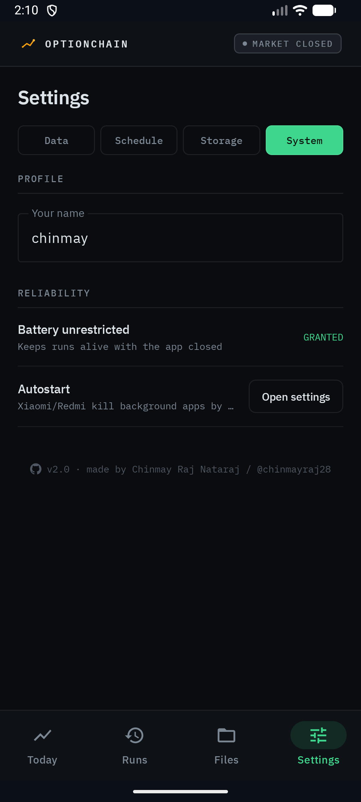 |

**Today** shows a live countdown to the next pull, a one tap **Download all now**, a **Pause** switch, and every index on your watchlist with the time it was last saved. The header keeps a market open or closed pill so you always know where you stand.

**Runs** keeps the record. Every automatic and manual run is listed with what it fetched and whether each file landed, so a missed download is never a mystery.

**Files** shows how much space the data is using, which live CSVs are current, and your EOD archive grouped by date. **Open folder** drops you straight into the phone's file browser.

## The nine core datasets

The daily pack collects the full set traders actually need for serious study.

1. **Index option chains** are captured once at the close, one certified file per index for all five indices.
2. **Index OHLC** for the open, high, low and close across the indices.
3. **India VIX** end of day close, kept as its own clean history.
4. **F&O bhavcopy** in the UDiFF format, the full derivatives picture.
5. **Participant wise open interest** so you can see how each type of player is positioned.
6. **Participant wise volume** so you can tell whether position changes came with real trading.
7. **FII and DII cash activity** for the institutional money flow.
8. **Advances and declines** for market breadth.
9. **Full cash bhavcopy with delivery** for stock level volume and delivery percentages.

You can turn the whole pack on or off with one switch, and pick exactly which of the nine you want to keep.

## Features

* Live chains for all five NSE index options
* Choose expiries as nearest, nearest three, or all
* Choose all strikes or a range around the money
* Pick the columns you want to see, including OI, change in OI, volume, IV, LTP and bid or ask
* Automatic refresh on a fixed interval, at set times, or only during market hours
* Save any view to CSV in one tap
* A full run history so you can see exactly what was fetched and when
* An in app file browser for your live files and your dated EOD archive
* The daily history pack runs by itself after close on trading days
* Optional copy of every CSV to Google Drive, with the same folder layout
* Smart date handling that walks back over weekends and holidays to find the last real trading day
* Files land in tidy dated folders so nothing gets overwritten by accident
* Built in updates, so new versions arrive without any store
* A gentle reminder to allow background running on phones that kill apps aggressively

## Where your files go

```
Download/OptionChain/                      live option chain CSVs
Download/OptionChain/EOD/<date_time>/      one folder per daily pack run
```

Turn on Google Drive in Settings and the same layout is mirrored to a folder there, so the files reach your laptop without a cable. Your phone always keeps its own copy either way.

## Install

This app is distributed on its own, outside any store.

1. Download the latest APK from the [Releases](../../releases) page.
2. Open it on your phone and allow installing from this source if asked.
3. Open the app and follow the short setup.

The app needs an Indian connection to reach the NSE data, so run it on a phone in India.

If your phone is aggressive about closing background apps, set OptionChain to **Unrestricted** under battery settings. The System tab in the app tells you where to look.

## How updates work

The app looks after itself. On launch it checks a small manifest in this repo. When a newer version is published it offers you the update, downloads it, and hands it to the system installer. No store, no manual hunting for the latest build.

Publishing a new version is simple. Bump the version in the app, build a signed release, upload the APK to a new release here, and point `update.json` at it. Every phone already running the app picks it up on the next launch.

## Built with

Kotlin and Jetpack Compose, with OkHttp for networking and WorkManager for the background schedule. Minimum Android 10.

## Credits

Made by Chinmay Raj Nataraj. Find me on GitHub as [@chinmayraj28](https://github.com/chinmayraj28).
